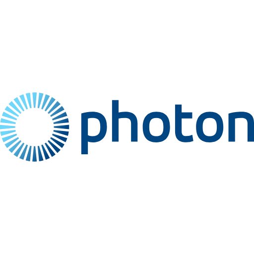

<!-- Improved compatibility of back to top link: See: https://github.com/othneildrew/Best-README-Template/pull/73 -->

<!-- PROJECT LOGO -->
 

  

<h3 align="center">Cooked</h3>

  

    A co-located multiplayer AR experience for Meta Quest 3
     
    <!-- <a href="https://lawtancool.github.io/Cooked"><strong>Project website »</strong></a> -->
    <!--   -->
     
    <a href="https://lawtancool.github.io/Cooked">Project Website</a>
    &middot;
    <a href="https://github.com/lawtancool/Cooked/blob/main/docs/images/Cooked.pdf">Poster (PDF)</a>
    &middot;
    <a href="https://www.youtube.com/watch?v=47_7hhijdsE">Demo Video</a>
  

<!-- ABOUT THE PROJECT -->
## About The Project

Inspired by the hit game *Overcooked!*, *Cooked* is the world's first co-located multiplayer cooking game developed for an augmented reality (AR) headset. Using Meta Quest 3 headsets, multiple players can work together to cook as many steaks as possible before time runs out! 

*Cooked* is a co-located experience, meaning players see and interact with each other while standing in the same real-world space. Players can hand off steaks to each other using their hands, or throw them across the room for their teammates to catch out of the air. 

*Cooked* uses the latest Meta Quest 3 AR capabilities to make  game objects blend seamlessly with reality. Scene understanding allows steaks to fall onto the floor, bounce off the walls, and cast simulated shadows onto the real world. Real-time depth mapping allows real-world objects like as furniture and people to appear in front of virtual objects, blocking their view as if the virtual objects were truly situated in the room. 

(<a href="#readme-top">back to top</a>)

## Demo Video
_(Click image to go to the video on YouTube)_

(<a href="#readme-top">back to top</a>)

## Built With

| Unity 6 | Photon Fusion 2 | Meta XR Building Blocks |
|:--:|:--:|:--:|
|  |  |  |

### Meta XR Building Blocks Used
- [Multiplayer Building Blocks](https://developers.meta.com/horizon/documentation/unity/bb-multiplayer-blocks)
    - *Local Matchmaking:* joins headsets to the same multiplayer room using Bluetooth discovery
    - *Shared Spatial Anchor Core:* uses camera data to creates shared points of reference, allowing multiple headsets to understand their relative positions in a shared physical space
    - *Colocation:* connects Shared Spatial Anchors to the Photon Fusion multiplayer system to enable colocated experiences
    - *Player Name Tag:* adds name tags above other players, useful for determining if colocation is active
- Augmented Reality (AR) Capabilities
    - [*Passthrough*](https://developers.meta.com/horizon/documentation/unity/unity-passthrough-tutorial-with-blocks/): Provides camera feed to allow players to see the real world
    - [*Occlusion*](https://developers.meta.com/horizon/documentation/unity/unity-depthapi-occlusions-get-started): Allows real-world objects such as other people to appear in front of virtual objects, creating a realistic sense of depth.
    - [*MRUK Scene API*](https://developers.meta.com/horizon/documentation/unity/unity-mr-utility-kit-overview): Provides scene understanding to allow virtual objects to fall and bounce off real-world walls, floors, and furniture.
    - [*MRUK Passthrough Relighting*](https://developers.meta.com/horizon/documentation/unity/unity-passthrough-relighting): Uses scene understanding to allow virtual objects to cast shadows and light on the real world.
- [Spatial Audio](https://developers.meta.com/horizon/documentation/unity/meta-xr-audio-sdk-unity): Allows game sounds to be perceived as coming from different directions as the player moves around the environment.

(<a href="#readme-top">back to top</a>)

<!-- ACKNOWLEDGMENTS -->
## Acknowledgments

This project was produced using two Meta Quest 3 headsets loaned from the University of Washington during the CSE 493V VR Systems course. We thank Douglas Lanman and John Akers for their support during the course!

(<a href="#readme-top">back to top</a>)

